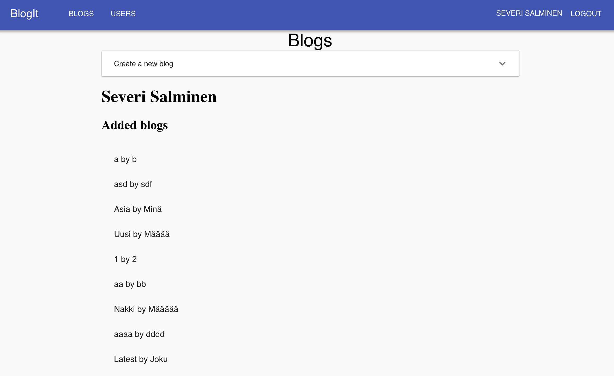

## Round 7 client

### Features

- State in Redux (uses redux-thunk)
- Material UI
- TypeScript typing
- Snapshot tests
- TSLint
- Puppeteer e2e tests (note: server has to be manually started before running the tests)

### Screenshot

